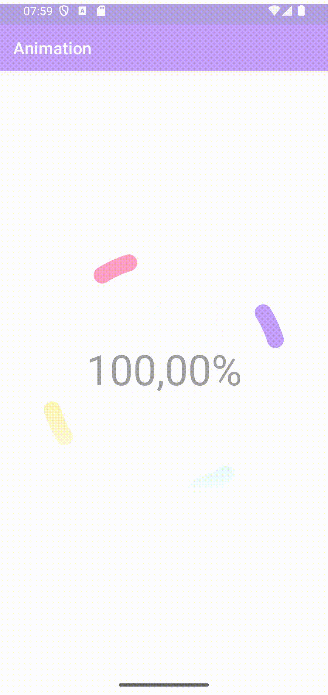
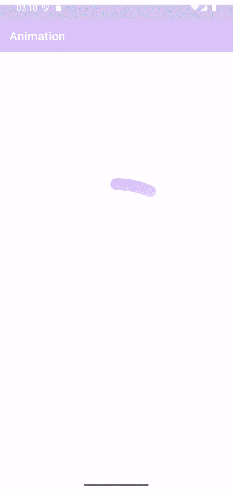
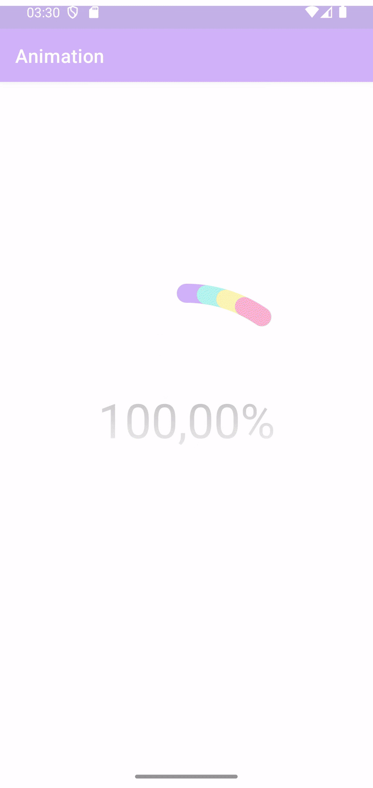

## Animations

### 1. Parallel filling

Параллельное заполнение данными

### 2. Rotation

Параллельное заполнение данными с одновременным поворотом на 360 градусов, текст остаётся неподвижным.

### 3. Sequential

Последовательное заполнение данными.

### 4. Bidirectional

Параллельное заполнение данными с началом отрисовки в центре каждого фрагмента

### 5. Progressive

## Attributes

Реализован выбор типа заполнения через XML. Используется `format="enum"` со следующими значениями: 
- parallel  
- sequential  
- bidirectional  
- progressive